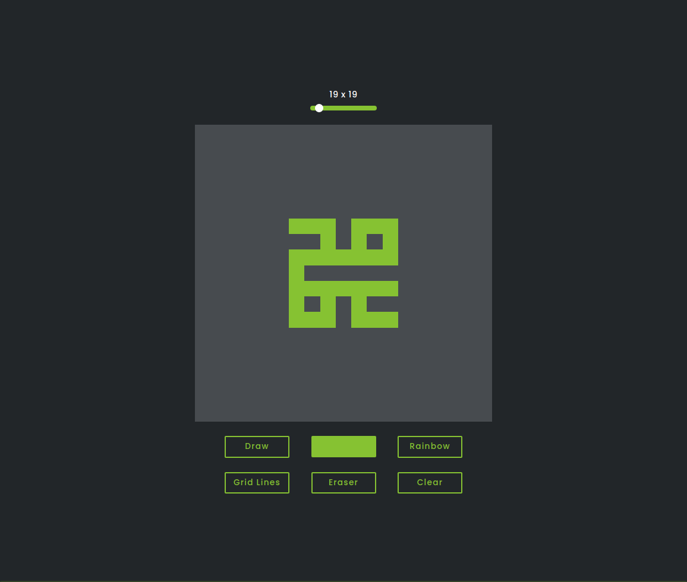

# Etch-A-Sketch
## What's the game about?
It's a sketching website or game where you can :
- Draw what's similar to pixel art.
- Test your Kufic Calligraphy ideas and skills before you open your favorite design software :D.
## Example: Mohamed

## Additional Info
Etch-A-Sketch game is the project right after the Rock-Paper-Scissors one
*Feel free to have a look at it on my profile if you haven't yet!*

I learnt a lot while making this project, possibly even more than the previous project! Mostly because it has many features which would overlap with each other causing a few bugs, though I ended up fixing *hopefully* all of them.
*Let me know if you find any, I'll happily fix them!*

So yep, it's another project I'm really happy about :D